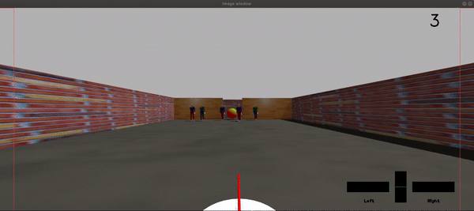

# SocNavAssist


Last updated: May 25th 2021

## Introduction

SocNavAssist is a haptic shared autonomy framework for enabling socially-aware navigation assistance for mobile telepresence robots.



***
<br>

## Installation

Tested on Ubuntu 18.04 and ROS Melodic

#### 1. Clone the repository
```
cd ~/catkin_ws/src
git clone --recurse-submodules https://github.com/kenembanisi/SocNavAssist.git
```
Or if you have already cloned the repo without submodules, run the command `git submodule update --init --recursive`

#### 2. Install `libnifalcon` following the instructions from [its repo](https://github.com/libnifalcon). See commands below:
```
mkdir build
cd build
cmake -G "Unix Makefiles" ..
make
make install
```
#### 3. Install `joy`
```
sudo apt-get install ros-melodic-joy
```
#### 4. (Optional) Create a virtual environment for Python 3 and install `pygame`. Required for running `pygame_viz.py`

<!-- ## Dependencies

* Tested on Ubuntu 18.04 and ROS Melodic
* `pygame_viz.py` depends on Python 3 and `pygame`
* Build and install `libnifalcon` (source files are already included) -->

#### 5. Source the workspace setup file
```
source ~/catkin_ws/devel/setup.bash
```

#### Known Issues:
* There's an issue with running `rosdep` because of `libnifalcon` can't be found. Hence, specifically for `realsense_ros`, you will need to install `librealsense2`. See installation information [here](https://github.com/IntelRealSense/librealsense/blob/master/doc/installation.md)

<br>

## How to Run

#### (Optional) Pre-Start: To enable haptic joystick control

1. In a new terminal, run `roscore`

2. In another terminal, start up the Novint Falcon joystick node:
```
rosrun ros_falcon joystick
```

#### Main Start:

1. To run individual scenarios:
```
roslaunch socially_aware_rvo trial.launch scenario:=<insert-scenario>
```
Currently available scenarios are:

* `approach_human`
* `crossing_human`
* `random_human`
* `approach_human_dense`
* `crossing_human_dense`
* `random_human_dense`

<br>

2. To run scenarios in a batch:
```
cd SocNavAssist/socially_aware_rvo/bash
./trial.sh
```
